# System Architecture

This document details the architecture of the **Firmable AI Agent**, a high-performance business intelligence system designed for autonomous website analysis and context-aware conversational AI.

## 🏗 High-Level Architecture

The system follows a microservices-inspired monolithic design, leveraging serverless cloud infrastructure for heavy lifting (Inference & Vectors) to maintain a lightweight application footprint.

```mermaid
graph TD
    %% Styling
    classDef app fill:#e1f5fe,stroke:#01579b,stroke-width:2px;
    classDef db fill:#fff3e0,stroke:#ff6f00,stroke-width:2px;
    classDef cloud fill:#f3e5f5,stroke:#7b1fa2,stroke-width:2px;
    classDef client fill:#e8f5e9,stroke:#2e7d32,stroke-width:2px;

    %% Nodes
    Client(["💻 Client / Frontend"])
    
    subgraph "Application Server (FastAPI)"
        API["API Router"]
        Scraper["🕷 Web Search & Scraper"]
        AISvc["🧠 AI Service Layer"]
        VecMgr["Vector Store Manager"]
    end

    subgraph "External Cloud Services"
        Groq["⚡ Groq Inference API<br/>(Llama 3 / Mixtral)"]
        Pinecone["Pinecone Serverless<br/>(Vector DB + Embedding)"]
    end

    subgraph "Persistence"
        SQLite[("💾 SQLite DB<br/>LangGraph Checkpoints")]
    end

    %% Apply Styles
    class API,Scraper,AISvc,VecMgr app;
    class SQLite db;
    class Groq,Pinecone cloud;
    class Client client;

    %% Interactive Flows
    Client -->|POST /analyze| API
    Client -->|POST /chat| API

    %% Analysis Flow (Blue)
    API -.->|1. Trigger| Scraper
    Scraper -.->|2. Content| AISvc
    AISvc -.->|3. Chunk| VecMgr
    VecMgr -.->|4. Upsert| Pinecone
    AISvc -.->|5. Extract JSON| Groq
    Groq -.->|6. Result| API

    %% Chat Flow (Red)
    API ==>|1. Query| AISvc
    AISvc ==>|2. Get State| SQLite
    AISvc ==>|3. Search| VecMgr
    VecMgr ==>|4. Retrieve| Pinecone
    Pinecone ==>|5. Context| AISvc
    AISvc ==>|6. Generate| Groq
    Groq ==>|7. Response| API
    AISvc ==>|8. Update State| SQLite
```

## 🧩 Component Breakdown

### 1. Application Layer (FastAPI)
The central orchestrator of the system.
-   **Endpoints**: RESTful API endpoints for `/analyze` and `/chat`.
-   **Security**: Bearer Token authentication via `HTTPBearer`.
-   **Performance**: Asynchronous (`async/await`) request handling to support high-concurrency scraping and inference.
-   **Rate Limiting**: `SlowAPI` integration to protect resources (e.g., 5 requests/min per IP).

### 2. Deep Web Scraper
A specialized module for extracting high-quality text from the web.
-   **Strategy**: Breadth-First Search (BFS) crawling with configurable depth (default: 3).
-   **Heuristics**: Automatically filters noise (ads, navbars, footers) to extract only relevant "Business Content".
-   **Output**: Clean, markdown-friendly text blocks ready for vectorization.

### 3. Dynamic Vector Store (Pinecone Serverless)
A novel approach to multi-tenant RAG.
-   **Dynamic Indexing**: Instead of one massive index, we create **ephemeral, dedicated indexes** for each analyzed URL.
    -   *Benefit*: Perfect isolation, zero data leakage between different website analyses.
-   **Serverless Embeddings**: We utilize Pinecone's **Inference API** (`llama-text-embed-v2`).
    -   *Process*: valid text is sent -> Pinecone embeds it -> Pinecone stores it. No local heavy ML models required.

### 4. Intelligence Layer (Groq)
The cognitive engine.
-   **Speed**: Leveraging Groq's LPU (Language Processing Unit) hardware for near-instant token generation.
-   **Models**: `llama-3-70b-8192` for high-fidelity reasoning and JSON extraction.
-   **Constraint**: STRICT JSON mode enforcement to ensuring reliable, distinct structured data outputs.

### 5. Agent Orchestration (LangGraph)
Manages the state and flow of conversations.
-   **State Machine**: Defines the conversation as a graph of nodes (User asks -> Agent thinks -> Agent answers).
-   **Checkpointer**: `AsyncSqliteSaver` persists the conversation state to a local SQLite file.
-   **Memory**: Allows the agent to strictly "remember" previous turns in the `thread_id`, enabling multi-turn follow-up questions.

---

## 🔄 Detailed Control Flow

### A. The Analysis Pipeline (`/analyze`)
This pipeline converts a raw URL into structured business intelligence.
1.  **Ingestion**: User submits `https://example.com`.
2.  **BFS Crawl**: Scraper visits the homepage, finds links, and visits subpages (e.g., /pricing, /about).
3.  **Indexing**:
    -   Content is chunked into 1000-character segments.
    -   `VectorStoreManager` creates a unique index name: `idx-example-a1b2`.
    -   Chunks are upserted to Pinecone.
4.  **Extraction**:
    -   The aggregated text is sent to Groq with a specialized "Analyst" system prompt.
    -   Groq extracts fields like `Industry`, `USP`, `Contact Info` into a JSON object.
5.  **Response**: The JSON is validated against Pydantic models and returned to the client.

### B. The Chat Pipeline (`/chat`)
This pipeline enables "Chat with Website" functionality using RAG.
1.  **Context Retrieval**:
    -   User asks: *"What is their pricing per user?"*
    -   System queries the *specific* Pinecone index for `example.com`.
    -   Top 5 most relevant text chunks are retrieved.
2.  **Prompt Assembly**:
    -   System creates a strict prompt: *"Answer ONLY using these 5 chunks: [...]"*.
3.  **Graph Execution**:
    -   LangGraph retrieves the history for `thread_id`.
    -   Current query + Context + History are sent to Groq.
4.  **Generation**:
    -   Groq generates a grounded response with citations.
5.  **Persistence**:
    -   The new Q&A pair is saved to SQLite for the next turn.
