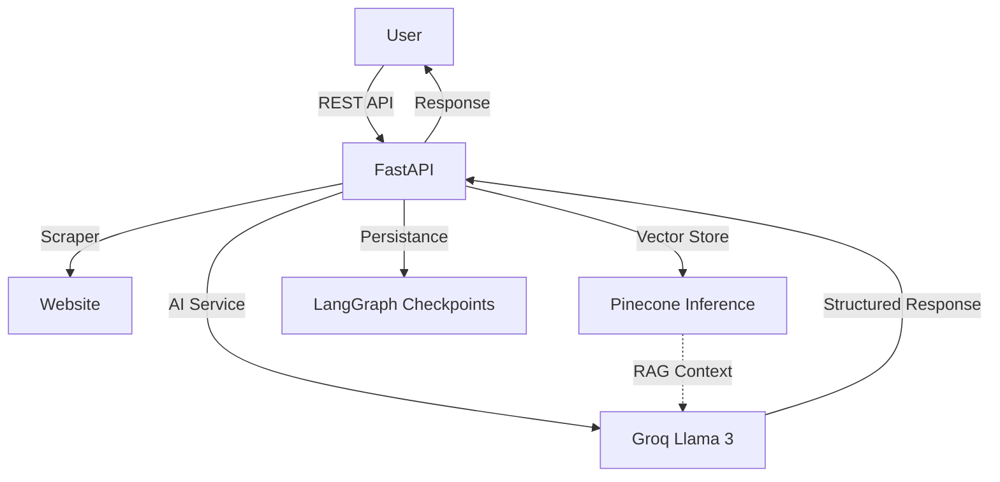

# Firmable AI Agent

Firmable AI is a high-performance FastAPI application designed to extract, synthesize, and interpret business insights from websites. It leverages **Groq (Llama 3)** for ultra-fast reasoning and **Pinecone Inference** for managed vector embeddings and retrieval.

## 🚀 Features
- **Semantic Extraction**: Automatically identifies Industry, Company Size, USP, Target Audience, and Overall Sentiment from homepage content.
- **Dynamic Website Indexing**: Automatically creates a dedicated Pinecone index for every website analyzed, ensuring total data isolation and efficient RAG (Retrieval-Augmented Generation).
- **Conversational AI**: A dedicated chat endpoint with persistent memory (LangGraph + SQLite) and strict grounding in the scraped website content.
- **Pinecone Inference**: Uses server-side embedding models (`llama-text-embed-v2`) for simplified infrastructure and high-speed retrieval.
- **Asynchronous Scraping**: Deep BFS scraping (up to depth 3) to build a comprehensive knowledge base of the target company.
- **Efficient Logging**: Centralized logging system with rotating file logs, detailed timestamps, and line-level debugging info.
- **Security & Rate Limiting**: Bearer token authentication and SlowAPI protection.

## 🛠️ Architecture


## 🧰 Tech Stack
- **FastAPI**: Main framework for high-performance API development.
- **Groq (Llama 3)**: Ultra-fast LLM inference.
- **Pinecone**: Managed vector database with server-side embeddings.
- **LangGraph**: For complex, stateful AI agent workflows.
- **SQLite**: Persistent conversational memory storage.
- **HTTPX & BeautifulSoup**: Asynchronous web scraping.

## ⚙️ Setup & Installation

### 1. Prerequisites
- Python 3.9+
- A Groq API Key ([console.groq.com](https://console.groq.com))
- A Pinecone API Key ([app.pinecone.io](https://app.pinecone.io))

### 2. Installation
```powershell
# Navigate to project directory
cd Firmable

# Install dependencies
pip install -r requirements.txt
```

### 3. Environment Configuration
Create a `.env` file in the root directory:
```env
SECRET_KEY=your_custom_secret_token
GROQ_API_KEY=your_groq_api_key
GROQ_MODEL=openai/gpt-oss-120b
PINECONE_API_KEY=your_pinecone_api_key
```

### 4. Running the Application
```powershell
uvicorn app.main:app --reload
```
Open `http://localhost:8000` in your browser to access the interactive dashboard.

## 📊 Logging
The application maintains detailed logs in the `/logs` directory:
- `app.log`: Contains all application events, error traces, and system status.
- Logs are rotated automatically (10MB per file, 5 backups kept).

## 📡 API Usage

### POST `/analyze`
Starts a deep scrape and semantic analysis of a website.
```json
{
    "url": "https://example.com",
    "questions": ["What is their core competitive advantage?"]
}
```

### POST `/chat`
Chat with the context of a previously analyzed website.
```json
{
    "url": "https://example.com",
    "query": "How do they calculate pricing?",
    "thread_id": "session_unique_id"
}
```

## 📝 License
Proprietary. Developed for business intelligence automation.
